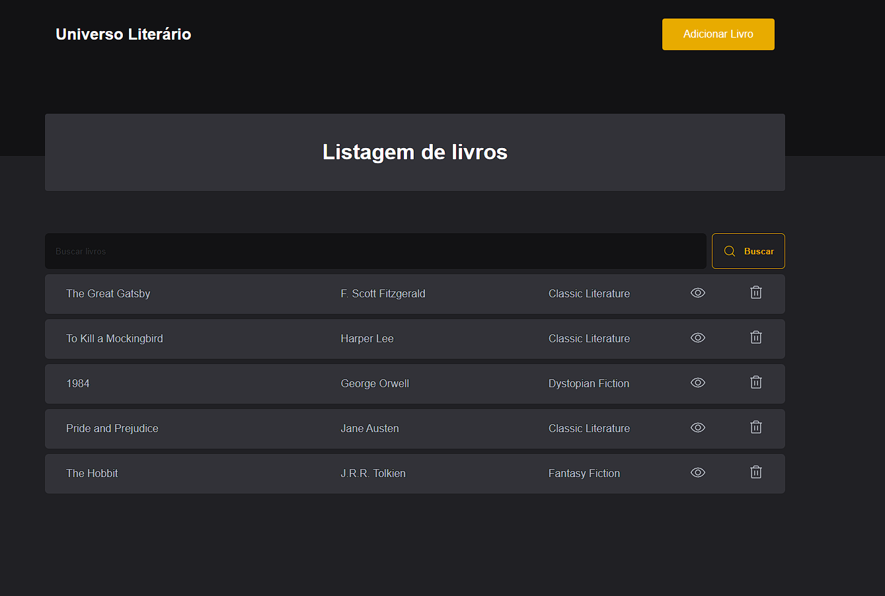

# Livraria Online

Uma aplicação web de uma livraria online, onde os usuários podem pesquisar conhecer livros.

## Funcionalidades

- Navegar pela coleção de livros.
- Pesquisar livros por título ou autor.
- Ver detalhes de um livro, incluindo nome, autor, sinopse e categoria.
- Adicionar livros.
- Excluir livros.

## Tecnologias Utilizadas

- React
- Typescript
- Styled-components
- Radix-ui

## Site online:
<a href=“https://livraria-romario.netlify.app/“>Site em produção</a>
